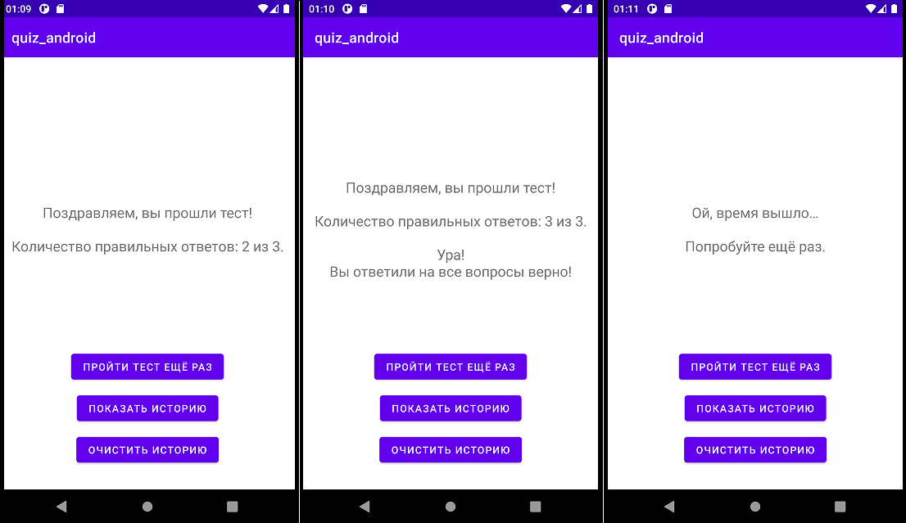
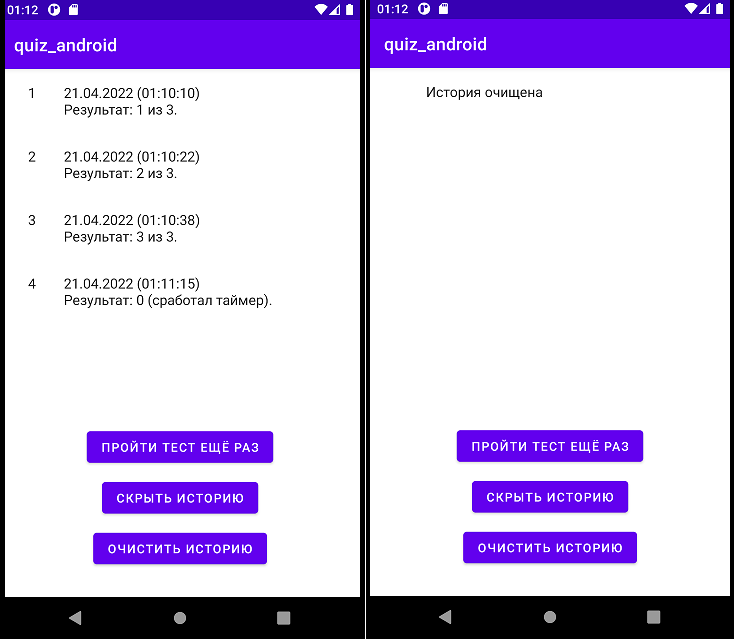

# Мини-квиз (Java, Android)
Краткое описание:

Приложение Android в виде викторины с таймером и счетчиком правильных ответов:
+ Реализовано через три Активити (главное/вопросы и ответы/финальное) с Фрагментами.
+ Вопросы и ответы читаются из внутренней БД SQLite.
+ Результаты сохраняются в файле *.txt во внутреннем хранилище приложения.

 

Технологии: **Java, Android\*, SQLite, File**. 
**Протестировано на Android API 30*
***

### Главное окно:

Выбираем уровень сложности и начинаем!

 

## Работа приложения:

 

После нажатия кнопки "Начать тест*" - проходим небольшой тест:

##### **Если вариант ответа не выбран, то появляется сообщение об этом.*
 

 

Итак, переходим к результатам*:

##### **Если Вы правильно ответили на все вопросы, то увидите дополнительное поздравление.*
##### **Если время таймера истекло, то приложение само переключится на финишное окно с соответствующим сообщением.*

 

 

После просмотра своего результата, можем посмотреть историю прохождения и очистить её:

